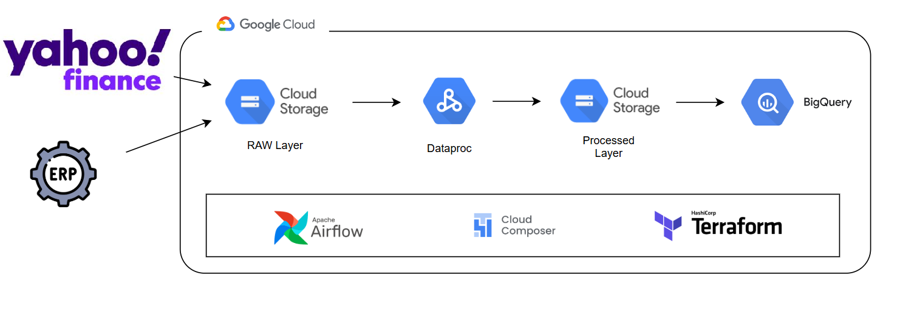

# Pipeline de Dados para Análise do Mercado de Ações

Um pipeline de dados totalmente serverless que centraliza e prepara dados do mercado de ações das suas empresas selecionadas. É baseado em uma arquitetura de dados moderna e escalável para ingestão, transformação e análise de dados do mercado de ações usando GCS, PySpark, BigQuery, Composer (Airflow) e Terraform.

A extração de dados da fonte é automatizada para recuperação diária de informações de preços de ações do **Yahoo Finance**. Em seguida, os dados são processados e modelados usando PySpark e carregados em um data warehouse moderno com um modelo dimensional para análise e visualização.

A arquitetura é baseada no Google Cloud Services e implantada usando Terraform como IaC.

## Conjunto de Dados

O **Yahoo Finance** é usado como fonte de dados primária para este projeto. É uma fonte gratuita e confiável que não requer chaves de API ou autenticação. Utilizamos a biblioteca Python `yfinance` para extrair dados históricos de preços de ações diariamente.

Por padrão, estamos buscando dados das empresas MAANG (META, AAPL, AMZN, NFLX, GOOGL), mas você pode modificar facilmente a lista de empresas no código.

## Ferramentas e Tecnologias

- **Google Cloud Storage:** Data lake para armazenar os arquivos de dados em duas camadas: Raw e Processed com arquivos Parquet.
- **Dataproc Serverless (PySpark):** Trata da transformação de dados e formatação em um modelo dimensional.
- **Google BigQuery:** Data warehouse analítico e backend do dashboard.
- **Google Composer (Airflow):** Orquestra o fluxo de trabalho de dados end-to-end em uma programação diária.
- **Terraform:** Gerencia infraestrutura como código para implantar todos os recursos na nuvem.
- **Yahoo Finance (yfinance):** Biblioteca Python para extração gratuita de dados financeiros.
- **uv:** Gerenciador de pacotes Python ultrarrápido para dependências e ambientes virtuais.

## Arquitetura de Dados

### Arquitetura Técnica



**Fontes de Dados**

- **Yahoo Finance:** A principal fonte de dados financeiros. Fornece dados históricos de preços de ações de forma gratuita através da biblioteca `yfinance`.
- **ERP:** Simulamos uma segunda fonte de dados deixando arquivos CSV na camada raw do data lake. Contém informações sobre várias empresas e bolsas.

> [!NOTE]
> Se alguma das suas empresas selecionadas não estiver incluída no arquivo `data/erp_companies.csv`, sinta-se à vontade para adicioná-la.

### Modelo Dimensional


- **fact_stock_price:** Esta é a tabela fato central que registra métricas diárias de preços de ações como abertura, fechamento, máxima, mínima e volume. Cada registro está vinculado a uma empresa, bolsa e data específica através de chaves estrangeiras. Seus dados são buscados do Yahoo Finance e adicionados à tabela toda vez que o processo é executado.
- **dim_company:** Uma tabela de dimensão que armazena informações sobre empresas. É carregada do arquivo ERP antes das transformações. Os dados são carregados após truncar a tabela.
- **dim_exchange:** Uma tabela de dimensão que armazena informações sobre bolsas de valores. É carregada do arquivo ERP antes das transformações. Os dados são carregados após truncar a tabela.
- **dim_date:** Uma tabela de dimensão de data padrão que fornece atributos de tempo úteis. É carregada de um arquivo CSV já preparado.

## Configuração

> [!WARNING]
> Esteja ciente de que este projeto implanta e executa serviços do Google Cloud que podem incorrer em custos.

### Pré-requisitos

> [!NOTE]
> Pule os seguintes passos se já estiverem feitos.

- [Conta GCP e instalação do gcloud CLI](setup/gcp_setup.md)

- [Instalação do Terraform](https://developer.hashicorp.com/terraform/tutorials/aws-get-started/install-cli)

- **Instalação do uv (Recomendado):**

```bash
# No macOS/Linux
curl -LsSf https://astral.sh/uv/install.sh | sh

# No Windows
powershell -c "irm https://astral.sh/uv/install.ps1 | iex"

# Ou via pip
pip install uv
```

### Configuração do Ambiente de Desenvolvimento

O projeto inclui um `Makefile` para automatizar tarefas comuns de desenvolvimento:

```bash
# Ver todos os comandos disponíveis
make help

# Configuração inicial do ambiente de desenvolvimento
make dev-setup

# Instalar dependências
make install          # Dependências básicas
make install-dev      # + ferramentas de desenvolvimento
make install-all      # + Airflow para desenvolvimento local

# Qualidade de código
make format          # Formatar código com black
make lint            # Verificar código com ruff
make lint-fix        # Corrigir problemas automaticamente
make type-check      # Verificar tipos com mypy
make check           # Executar todas as verificações

# Validação completa
make validate        # Lint + tipos + testes

# Terraform
make tf-init         # Inicializar Terraform
make tf-plan         # Ver plano de infraestrutura
make tf-apply        # Aplicar mudanças
make tf-destroy      # Destruir infraestrutura

# Utilitários
make clean           # Limpar arquivos temporários
make env-info        # Informações do ambiente
make upload-erp      # Upload arquivo ERP para GCS

# Gerenciar dependências
make add-dep PACKAGE=nome-do-pacote
make add-dev-dep PACKAGE=ferramenta-dev
```

### Implantação

- Vá para o diretório infra:

```
cd infra
```

- Defina o ID do projeto e service_account no arquivo infra/variables.tf

Empresas MAANG. Se você quiser analisar outras empresas, mude os símbolos na variável `SYMBOLS` no arquivo `dags/stock_market_dag.py`.

- Inicialize o terraform e baixe as dependências:

```
make tf-init
```

- Visualize o plano do Terraform:

```
make tf-plan
```

> [!NOTE]
> Embora seja possível criar um cluster Dataproc manualmente, este projeto aproveita o Airflow para automatizar todo o processo: desde o provisionamento do cluster Dataproc, executando o job PySpark, até deletar automaticamente o cluster uma vez que o job esteja completo.

- Crie os recursos:

```
make tf-apply
```

- Digite `yes` para confirmar. O ambiente pode levar 20-25 minutos para ser completamente implantado.

- Faça login no Console GCP e vá para o serviço Composer.

- Para ativar o sensor do Composer, faça upload do arquivo erp_companies.csv fornecido:

```
make upload-erp
```

- Quando todas as tarefas estiverem finalizadas, você poderá ver dados raw e processados dentro do GCS e executar consultas no modelo dimensional no BigQuery.

- Quando terminar com o projeto, finalize os serviços na nuvem:

```
make tf-destroy
```

## Referências

- https://medium.com/@williamwarley/a-complete-guide-to-deploy-main-services-in-gcp-with-terraform-f16f18655ca8
- https://pypi.org/project/yfinance/
- https://docs.astral.sh/uv/ - Documentação do uv
